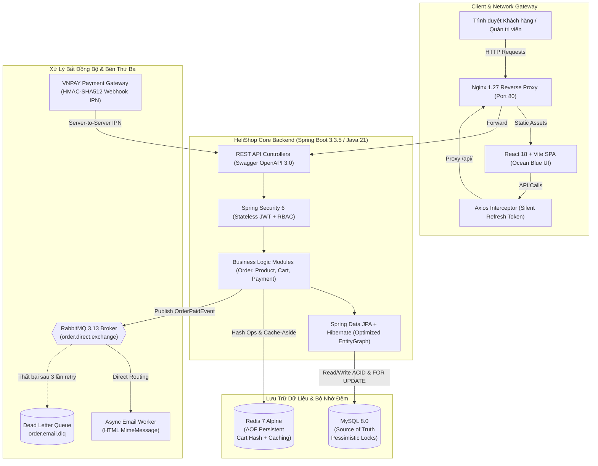
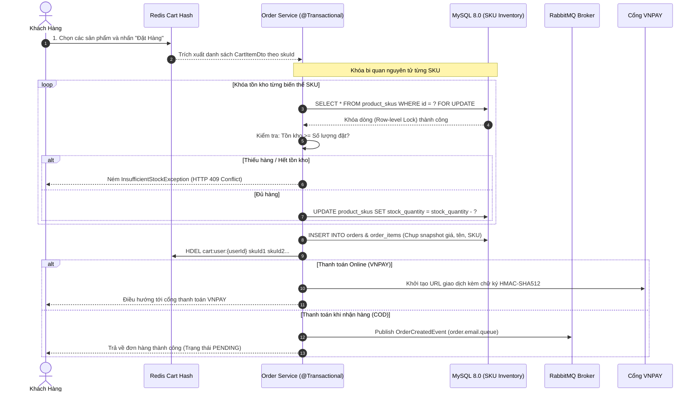
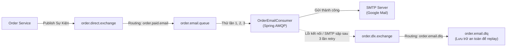
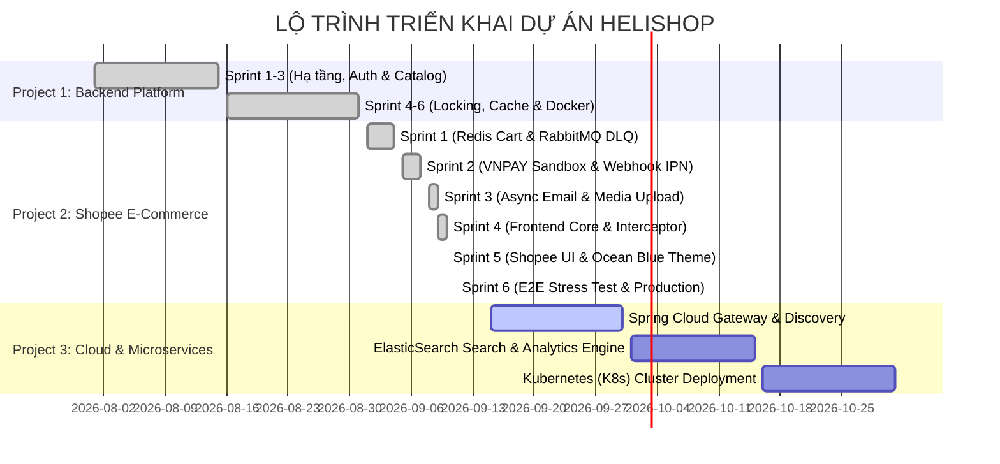

# 🛒 HeliShop - Enterprise E-Commerce Platform

<div align="center">


### Nền Tảng Thương Mại Điện Tử Toàn Diện Chuẩn Doanh Nghiệp
*Lấy cảm hứng từ mô hình Shopee Mall • Kiến trúc Domain-Driven Layered • Chịu tải cao & Chống âm kho Flash Sale*

[](https://openjdk.org/)
[](https://spring.io/projects/spring-boot)
[](https://react.dev/)
[](https://www.typescriptlang.org/)
[](https://tailwindcss.com/)
[](https://www.mysql.com/)
[](https://redis.io/)
[](https://www.rabbitmq.com/)
[](https://www.docker.com/)
[]()
[](http://localhost:8080/swagger-ui/index.html)

</div>

---

## 📖 Mục Lục
- [🌟 Tổng Quan Dự Án](#-tổng-quan-dự-án)
- [🏛️ Kiến Trúc Hệ Thống & Luồng Dữ Liệu](#️-kiến-trúc-hệ-thống--luồng-dữ-liệu)
- [⚡ Các Tính Năng & Điểm Sáng Kỹ Thuật](#-các-tính-năng--điểm-sáng-kỹ-thuật)
- [💻 Ngăn Xếp Công Nghệ (Tech Stack)](#-ngăn-xếp-công-nghệ-tech-stack)
- [📂 Cấu Trúc Thư Mục Dự Án](#-cấu-trúc-thư-mục-dự-án)
- [🚀 Hướng Dẫn Cài Đặt & Khởi Chạy Nhanh](#-hướng-dẫn-cài-đặt--khởi-chạy-nhanh)
- [🌐 Bảng Cổng Dịch Vụ & Tài Khoản Kiểm Thử](#-bảng-cổng-dịch-vụ--tài-khoản-kiểm-thử)
- [🧪 Kiểm Thử & Đảm Bảo Chất Lượng (QA)](#-kiểm-thử--đảm-bảo-chất-lượng-qa)
- [📑 Tài Liệu API (OpenAPI 3.0 / Swagger)](#-tài-liệu-api-openapi-30--swagger)
- [🗺️ Lộ Trình Phát Triển (Roadmap)](#️-lộ-trình-phát-triển-roadmap)

---

## 🌟 Tổng Quan Dự Án

**HeliShop** là nền tảng thương mại điện tử đa người bán (Multi-vendor E-Commerce) thế hệ mới, được thiết kế và xây dựng theo chuẩn mực doanh nghiệp. Hệ thống giải quyết trọn vẹn các bài toán kỹ thuật phức tạp trong thương mại điện tử:

1. **Hiệu năng & Tốc độ Giỏ hàng**: Động cơ giỏ hàng phân tán vận hành trên **Redis Hash Map** tốc độ truy xuất mili-giây, gom nhóm theo từng Shop chuẩn Shopee và duy trì vòng đời dữ liệu 30 ngày.
2. **Bảo vệ Tồn kho Flash Sale Chống Âm Kho**: Áp dụng cơ chế **Khóa bi quan (`PESSIMISTIC_WRITE`)** trên từng biến thể SKU, triệt tiêu race condition kể cả khi có hàng trăm luồng đặt hàng đồng thời.
3. **Giao dịch Phân tán & Khả năng Chịu lỗi (Fault Tolerance)**: Tích hợp **RabbitMQ 3.13** định tuyến sự kiện đơn hàng bất đồng bộ, hỗ trợ retry 3 lần và chuyển tiếp an toàn vào **Dead Letter Queue (DLQ)** khi hệ thống mail gặp sự cố.
4. **Cổng Thanh Toán Trực Tuyến An Toàn**: Tích hợp **VNPAY Sandbox** xác thực chữ ký số **HMAC-SHA512**, Webhook IPN xử lý bất đồng bộ chuẩn **Idempotent** (chống xử lý lặp giao dịch).
5. **Giao Diện Shopee Mall Hiện Đại**: Ứng dụng **React 18 SPA**, bộ nhận diện thương hiệu **Ocean Blue (`#0284C7`)**, cơ chế lọc danh mục đệ quy đa tầng, PDP biến thể 2 cấp và **100% dữ liệu thật kết nối Backend REST API (Zero mockData)**.

---

## 🏛️ Kiến Trúc Hệ Thống & Luồng Dữ Liệu

### 1. Sơ Đồ Kiến Trúc Tổng Thể (System Architecture)



---

### 2. Luồng Checkout Nguyên Tử & Chống Âm Kho (Hybrid Transaction Flow)



---

### 3. Cơ Chế Chịu Lỗi Email Worker Với Dead Letter Queue (DLQ)



---

## ⚡ Các Tính Năng & Điểm Sáng Kỹ Thuật

### 🛍️ Phân Hệ Giỏ Hàng Redis (Redis Cart Engine)
- **Tốc độ mili-giây**: Toàn bộ thao tác thêm, bớt, xóa sản phẩm trong giỏ thực thi trực tiếp trên cấu trúc **Redis HASH (`cart:user:{userId}`)**.
- **Shopee Multi-shop Grouping**: Dữ liệu giỏ hàng trả về cho Client được tự động phân tách và gom nhóm logic theo từng Shop (`CartShopGroupResponse`).
- **Gia hạn tự động (TTL 30 ngày)**: Khóa Redis được đặt thời gian sống 30 ngày (2,592,000 giây) và tự động gia hạn (`EXPIRE`) mỗi khi giỏ hàng có tương tác mới.
- **Dọn dẹp nguyên tử**: Khi checkout thành công, hệ thống xóa chính xác các SKU đã đặt mà không làm ảnh hưởng tới các mặt hàng khác trong giỏ.

### 🛡️ Kiểm Soát Tồn Kho Flash Sale & Chống Race Condition
- **Khóa bi quan (`PESSIMISTIC_WRITE`)**: Sử dụng cú pháp `SELECT ... FOR UPDATE` thông qua JPA để khóa bản ghi SKU trước khi trừ kho.
- **Stress Concurrency Verified**: Đã vượt qua kiểm thử tải đồng thời **200 threads** tranh mua cùng một sản phẩm tồn kho giới hạn; loại bỏ hoàn toàn hiện tượng âm kho (Overselling) và Deadlock.
- **Cơ chế Hoàn kho tự động**: Khi đơn hàng bị người dùng hủy (`CANCELLED`) hoặc người bán trả hàng (`RETURNED`), hệ thống kích hoạt transaction tự động hoàn trả số lượng tồn kho cho SKU và Product tương ứng.

### 💳 Cổng Thanh Toán VNPAY & Webhook IPN Idempotent
- **Mã hóa an toàn**: Tạo chuỗi thanh toán VNPAY bảo mật tuyệt đối với thuật toán băm chữ ký số **HMAC-SHA512**.
- **Xử lý bất đồng bộ qua Webhook IPN**: Ghi nhận kết quả thanh toán từ VNPAY qua endpoint `/api/v1/payments/vnpay-ipn`.
- **Tính toán đẳng năng (Idempotent)**: Ngăn ngừa xử lý trùng lặp giao dịch khi máy chủ thanh toán gửi retry nhiều lần, đảm bảo đơn hàng chỉ cập nhật `PAID` duy nhất 1 lần.

### 📨 Hàng Đợi Bất Đồng Bộ RabbitMQ & Chống Nghẽn Luồng
- **Tách biệt tác vụ nặng**: Luồng gửi email xác nhận đơn hàng, biên lai thanh toán được đẩy sang worker bất đồng bộ, giúp API phản hồi cho khách hàng ngay lập tức (< 100ms).
- **Chính sách Thử lại & DLQ**: Cấu hình Spring AMQP retry với khoảng lặp tăng dần (2s $\rightarrow$ 4s $\rightarrow$ 8s, tối đa 3 lần). Khi dịch vụ mail gặp sự cố, message được giữ an toàn tại Dead Letter Queue (`order.email.dlq`) mà không bao giờ bị mất dữ liệu.

### 🎨 Trải Nghiệm Frontend Shopee Mall Toàn Diện (Ocean Blue)
- **Chuẩn phong cách Shopee**: Thiết kế giao diện theo phong cách Shopee Mall với bộ nhận diện cao cấp **Ocean Blue (`#0284C7`)**.
- **Cây danh mục đệ quy**: Hiển thị sidebar danh mục đa cấp, tự động lọc cả danh mục cha lẫn các danh mục con cháu.
- **Trang chi tiết sản phẩm (PDP)**: Hỗ trợ biến thể SKU 2 chiều (Màu sắc, Kích thước), tự động đồng bộ giá bán, số lượng tồn kho thực tế và hình ảnh sản phẩm.
- **Sticky Checkout Bar**: Thanh tính tiền bám dính thông minh, hỗ trợ áp dụng mã giảm giá (Vouchers), tính toán phí vận chuyển và giảm giá linh hoạt.
- **6 Tab Quản lý Đơn hàng**: Quản lý đầy đủ vòng đời đơn hàng: *Tất cả, Chờ thanh toán, Đang xử lý, Đang vận chuyển, Hoàn thành, Đã hủy*.
- **Chống Race Condition Refresh Token**: Tích hợp hàng đợi `failedQueue` trong Axios Interceptor, ngăn chặn tình trạng bắn đồng loạt nhiều request refresh token khi Access Token hết hạn.
- **100% Real API Driven**: Loại bỏ hoàn toàn mockData, frontend kết nối 100% vào cơ sở dữ liệu MySQL thông qua REST API.

### 🚀 Tối Ưu Hóa Hiệu Năng Truy Vấn & Caching
- **Trị dứt điểm bài toán N+1 Query**: Ứng dụng `@EntityGraph(attributePaths = {"category", "shop", "skus", "images"})` giúp tải toàn bộ thông tin sản phẩm chỉ với 1 câu SQL `JOIN`.
- **Redis Cache-Aside**: Áp dụng `@Cacheable` cho các dữ liệu ít biến động (chi tiết sản phẩm, cấu trúc cây danh mục) và `@CacheEvict` tự động xóa cache khi người bán cập nhật hàng hóa.

---

## 💻 Ngăn Xếp Công Nghệ (Tech Stack)

| Lớp Kiến Trúc | Công Nghệ / Thư Viện | Phiên Bản | Mô Tả Vai Trò |
| :--- | :--- | :---: | :--- |
| **Backend Core** | Java (OpenJDK / Eclipse Temurin) | **21** | Tận dụng Record, Pattern Matching & Virtual Threads |
| **Framework** | Spring Boot | **3.3.5** | Spring MVC, Spring Data JPA, Spring AMQP, Spring Mail |
| **Security** | Spring Security & JJWT | **6.x / 0.12.6** | Phân quyền RBAC, Stateless JWT (15m), Redis Refresh (7d) |
| **Data Mapping** | MapStruct & Lombok | **1.5.5 / 1.18.34** | Tự động sinh mapper DTO compile-time hiệu năng cao |
| **API Docs** | Springdoc OpenAPI | **2.6.0** | Tài liệu hóa OpenAPI 3.0 tự động kèm Swagger UI |
| **Frontend UI** | React | **18.3.1** | Xây dựng Single Page Application chuẩn component hóa |
| **Build Tool** | Vite | **5.4.9** | Hot Module Replacement (HMR) và tối ưu bundle build |
| **Ngôn Ngữ** | TypeScript | **5.6.3** | Đảm bảo tính chặt chẽ về mặt kiểu dữ liệu |
| **Styling** | Tailwind CSS | **3.4.14** | Utility-first CSS, thiết kế responsive và theme Ocean Blue |
| **Quản Lý State** | Zustand | **5.0.0** | Lưu trữ client state nhẹ nhàng, đồng bộ LocalStorage |
| **Server State** | TanStack Query | **5.59.16** | Caching API requests, xử lý background refetch |
| **HTTP Client** | Axios | **1.7.7** | Request/Response interceptor với cơ chế failedQueue |
| **Cơ Sở Dữ Liệu** | MySQL Server | **8.0** | Lưu trữ quan hệ chính thống, InnoDB Engine, utf8mb4 |
| **Bộ Nhớ Đệm** | Redis Server | **7-alpine** | Giỏ hàng phân tán (Hash), Refresh Token, AOF Persistent |
| **Message Broker** | RabbitMQ | **3.13-management** | Hàng đợi sự kiện đơn hàng, DLQ, Exchange định tuyến |
| **Reverse Proxy** | Nginx | **1.27-alpine** | Định tuyến SPA, Gzip nén tĩnh, chuyển tiếp proxy `/api/` |
| **Containerization**| Docker & Docker Compose | **v2+** | Môi trường đóng gói Multi-stage build cho dev & prod |

---

## 📂 Cấu Trúc Thư Mục Dự Án

```plaintext
WebMall/
├── backend/                            # Toàn bộ mã nguồn Spring Boot Core Backend
│   ├── src/main/java/com/helishop/core/
│   │   ├── HeliShopApplication.java   # Bootstrap application
│   │   ├── common/                    # Lớp dùng chung: BaseEntity, Exception, ApiResponse<T>
│   │   ├── config/                    # Cấu hình hệ thống (Security, Redis, RabbitMQ, Swagger)
│   │   ├── security/                  # Bộ lọc JWT (JwtFilter, JwtUtils, UserDetails)
│   │   └── modules/                   # 8 Phân hệ nghiệp vụ độc lập (Domain Modules)
│   │       ├── auth/                  # Đăng ký, Đăng nhập, Refresh Token, Phân quyền RBAC
│   │       ├── user/                  # Hồ sơ người dùng, Quản lý địa chỉ giao hàng, Gian hàng Shop
│   │       ├── product/               # Hàng hóa, Biến thể SKU, Cây danh mục, Lọc động JPA Spec
│   │       ├── cart/                  # Động cơ giỏ hàng Shopee trên Redis Hash (TTL 30 ngày)
│   │       ├── order/                 # Đơn hàng, Khóa bi quan trừ tồn kho, Hoàn kho khi hủy đơn
│   │       ├── payment/               # Cổng thanh toán VNPAY, Ký số HMAC-SHA512, Idempotent IPN
│   │       ├── notification/          # RabbitMQ Async Email Consumer, Retry x3, Dead Letter Queue
│   │       └── media/                 # Tải lên tệp đa phương tiện (Cloudinary / Local storage)
│   ├── src/main/resources/
│   │   ├── application.yml            # Cấu hình kết nối MySQL, Redis, RabbitMQ, Mail, JWT
│   │   └── seed-data.sql              # Kịch bản nạp dữ liệu mẫu chuẩn xác cho hệ thống
│   ├── src/test/                      # 103 bài kiểm thử chuyên sâu (Unit, Integration, E2E, Stress)
│   ├── Dockerfile                     # Multi-stage Dockerfile cho Backend (Temurin 21 JRE)
│   └── pom.xml                        # Quản lý thư viện phụ thuộc Maven
│
├── frontend/                           # Toàn bộ mã nguồn ứng dụng React 18 SPA
│   ├── src/
│   │   ├── components/                # UI Components tái sử dụng (Header, Footer, ProductCard...)
│   │   ├── pages/                     # 8 màn hình chính (Home, PDP, Cart, Checkout, Orders...)
│   │   ├── store/                     # Zustand stores (useAuthStore, useCartStore...)
│   │   ├── lib/                       # Cấu hình Axios Interceptor (failedQueue silent refresh)
│   │   ├── types/                     # Định nghĩa TypeScript interfaces (Product, Cart, Order...)
│   │   ├── App.tsx                    # Định tuyến đường dẫn ứng dụng (Routing)
│   │   └── index.css                  # Cấu hình Tailwind CSS và biến màu thương hiệu Ocean Blue
│   ├── nginx.conf                     # Cấu hình máy chủ Nginx reverse proxy cho production
│   ├── Dockerfile                     # Multi-stage Dockerfile cho Frontend (Node 20 -> Nginx)
│   ├── package.json                   # Khai báo dependencies NPM
│   └── vite.config.ts                 # Cấu hình build Vite & proxy development
│
├── docs/                               # Tài liệu thiết kế, Kiến trúc & Bộ nhớ dự án
│   ├── ARCHITECTURE.md                # Tài liệu chi tiết thiết kế kiến trúc hệ thống
│   ├── ROADMAP.md                     # Lộ trình hoàn thành 12 Sprints qua các giai đoạn
│   ├── MEMORY.md                      # Trạng thái hiện thời, thông số cổng, tài khoản & bài học
│   └── sprints/                       # Nhật ký chi tiết của từng Sprint từ 1 đến 6
│
├── docker-compose.yml                 # Môi trường hạ tầng phát triển Local (MySQL, Redis, RabbitMQ, Backend)
├── docker-compose.production.yml      # Cụm 5 dịch vụ khép kín Production (Frontend Nginx, Backend, DBs)
└── AGENTS.md                          # Bộ quy tắc làm việc cho AI Agents & Git Commit Policy
```

---

## 🚀 Hướng Dẫn Cài Đặt & Khởi Chạy Nhanh

Bạn có thể khởi chạy hệ thống theo **2 cách**: Triển khai toàn diện với Docker Production (Khuyến nghị) hoặc Chạy môi trường Phát triển Local (Development).

### Cách 1: Khởi Chạy Trọn Gói Với Docker Compose Production (Khuyến nghị)

Chỉ với 1 câu lệnh duy nhất, toàn bộ 5 dịch vụ (`frontend`, `backend`, `mysql`, `redis`, `rabbitmq`) sẽ được tự động biên dịch và khởi chạy:

```bash
docker compose -f docker-compose.production.yml up -d --build
```

Sau khi các container đạt trạng thái `healthy`:
- **Giao diện người dùng (Frontend)**: Truy cập `http://localhost` (Port 80)
- **Tài liệu API tương tác (Swagger UI)**: Truy cập `http://localhost:8080/swagger-ui/index.html`
- **Bảng điều khiển RabbitMQ**: Truy cập `http://localhost:15672` (Tài khoản: `guest` / `guest`)

Dừng và dọn dẹp hệ thống:
```bash
docker compose -f docker-compose.production.yml down
```

---

### Cách 2: Khởi Chạy Môi Trường Phát Triển Local (Development)

#### Yêu Cầu Môi Trường Cần Chuẩn Bị
- **Java**: OpenJDK / Temurin 21 trở lên
- **Node.js**: Phiên bản 18+ (khuyên dùng Node 20 LTS) & `npm`
- **Docker & Docker Compose**: Để khởi chạy các dịch vụ lưu trữ phụ trợ

---

#### Bước 1: Khởi động các dịch vụ phụ trợ (MySQL, Redis, RabbitMQ)
Chạy lệnh sau tại thư mục gốc của dự án:
```powershell
docker compose up -d mysql redis rabbitmq
```
*Lệnh này khởi động MySQL 8.0 (Port 3307), Redis 7 (Port 6379), RabbitMQ 3.13 (Port 5672/15672).*

---

#### Bước 2: Nạp dữ liệu mẫu (Seed Data) vào Cơ sở dữ liệu
Hệ thống sử dụng tệp SQL mẫu chi tiết [backend/src/main/resources/seed-data.sql](file:///d:/D%E1%BB%B1%20%C3%A1n%20c%C3%A1%20nh%C3%A2n/WebMall/backend/src/main/resources/seed-data.sql) chứa đầy đủ danh mục, gian hàng Mall, sản phẩm biến thể, tồn kho và voucher:

```powershell
# Thực thi nạp dữ liệu trực tiếp vào container MySQL
Get-Content backend\src\main\resources\seed-data.sql | docker exec -i eshop_mysql mysql -ueshop_user -peshop_secret eshop_db
```
*(Trên hệ điều hành Linux/macOS: `cat backend/src/main/resources/seed-data.sql | docker exec -i eshop_mysql mysql -ueshop_user -peshop_secret eshop_db`)*

---

#### Bước 3: Khởi chạy Backend (Spring Boot Core)
Di chuyển vào thư mục `backend` và khởi động máy chủ API:
```powershell
cd backend
.\mvnw.cmd spring-boot:run
```
*Máy chủ Backend sẽ lắng nghe tại `http://localhost:8080`.*

---

#### Bước 4: Khởi chạy Frontend (React 18 + Vite)
Mở một cửa sổ dòng lệnh mới, di chuyển vào thư mục `frontend` và khởi động:
```powershell
cd frontend
npm install
npm run dev
```
*Ứng dụng giao diện sẽ sẵn sàng tại `http://localhost:5173` với cơ chế Hot Reload (HMR).*

---

## 🌐 Bảng Cổng Dịch Vụ & Tài Khoản Kiểm Thử

### 1. Bảng Thông Số Cổng Dịch Vụ

| Dịch Vụ | Cổng (Port) | Địa Chỉ Truy Cập (URL) | Thông Tin Đăng Nhập Mặc Định |
| :--- | :---: | :--- | :--- |
| **Frontend Web (Dev)** | `5173` | `http://localhost:5173` | Giao diện React 18 + Vite |
| **Frontend Web (Prod)** | `80` | `http://localhost` | Phục vụ qua Nginx Reverse Proxy |
| **Backend REST API** | `8080` | `http://localhost:8080` | Spring Boot 3 Core Server |
| **Swagger UI (OpenAPI 3)** | `8080` | `http://localhost:8080/swagger-ui/index.html` | Tài liệu API tương tác trực tiếp |
| **MySQL Server** | `3307` | `localhost:3307` (Host) $\rightarrow$ `3306` | User: `eshop_user` • Pass: `eshop_secret` |
| **Redis Server** | `6379` | `localhost:6379` | Không yêu cầu mật khẩu local |
| **RabbitMQ Management** | `15672` | `http://localhost:15672` | User: `guest` • Pass: `guest` |
| **RabbitMQ AMQP Broker** | `5672` | `localhost:5672` | Giao thức truyền tin nhị phân AMQP |

---

### 2. Danh Sách Tài Khoản Kiểm Thử Chuẩn Hệ Thống

Tất cả các tài khoản dưới đây đã được khởi tạo sẵn mật khẩu chung là: `Password123!`

| Phân Quyền (Role) | Họ Và Tên / Đơn Vị | Gmail Đăng Nhập | Số Điện Thoại | Mục Đích Kiểm Thử |
| :--- | :--- | :--- | :---: | :--- |
| **CUSTOMER** | Vũ Viết Anh | `vuvietanh@gmail.com` | `0988889999` | Tài khoản khách hàng chính (Có địa chỉ mặc định tại Hà Nội) |
| **ADMIN** | Quản Trị Viên Sàn | `admin.helishop@gmail.com` | `0901111111` | Quản trị viên hệ thống sàn thương mại điện tử |
| **SELLER** | Apple Flagship Store | `seller.apple@gmail.com` | `0902222222` | Quản lý sản phẩm Apple chính hãng |
| **SELLER** | Sony Official Store | `seller.sony@gmail.com` | `0903333333` | Quản lý thiết bị âm thanh & tai nghe Sony |
| **SELLER** | NuPhy Studio VN | `seller.nuphy@gmail.com` | `0904444444` | Bàn phím cơ không dây thời trang |
| **SELLER** | Coolmate Official | `seller.coolmate@gmail.com` | `0905555555` | Thời trang nam ứng dụng cao cấp |
| **SELLER** | Logitech G Official | `seller.logitech@gmail.com` | `0906666666` | Chuột, bàn phím & phụ kiện gaming |
| **SELLER** | Anker Official Store | `seller.anker@gmail.com` | `0907777777` | Củ sạc nhanh & cáp sạc GaN |

> [!TIP]
> **Hỗ trợ đăng nhập linh hoạt**: Hệ thống cho phép người dùng đăng nhập bằng **cả Gmail hoặc Số điện thoại** với cùng một mật khẩu đã thiết lập.

---

### 3. Danh Sách Mã Giảm Giá (Vouchers) Có Sẵn
- `HELI50K`: Giảm ngay 50.000₫ cho mọi đơn hàng từ 200.000₫.
- `HELI100K`: Giảm 100.000₫ cho đơn hàng từ 500.000₫.
- `HELI500K`: Giảm 500.000₫ cho đơn hàng công nghệ từ 2.000.000₫.
- `VNPAY10`: Giảm 10% khi thanh toán qua cổng VNPAY QR.
- `FREESHIP`: Miễn phí vận chuyển toàn quốc (giảm 30.000₫).

---

## 🧪 Kiểm Thử & Đảm Bảo Chất Lượng (QA)

Dự án sở hữu bộ kiểm thử tự động toàn diện gồm **103 bài kiểm thử (100% Passed)** trải dài từ tầng Unit Test, MockMvc Integration Test đến E2E Concurrency Stress Test:

<div align="center">

| Nhóm Kiểm Thử | Số Lượng Test | Mục Tiêu Đảm Bảo |
| :--- | :---: | :--- |
| **Concurrency Stress Test** | 2 tests | Kiểm thử tải 200 threads đồng thời với `CountDownLatch`: Chống âm kho & Race Condition |
| **E2E Payment & DLQ** | 2 tests | Giả lập Webhook VNPAY chữ ký số, Idempotent và chuyển tin sang Dead Letter Queue khi SMTP sập |
| **Pessimistic Locking** | 4 tests | Khóa bi quan `PESSIMISTIC_WRITE`, trừ tồn kho nguyên tử & kiểm tra ngoại lệ `InsufficientStockException` |
| **Order Status & Return** | 3 tests | Kiểm tra hoàn trả tồn kho tự động khi trạng thái chuyển sang `CANCELLED` hoặc `RETURNED` |
| **Redis Cart Engine** | 10 tests | Thêm, sửa, xóa, dọn giỏ, cấu trúc gom nhóm Shop và gia hạn TTL 30 ngày trên Redis HASH |
| **Redis Cache-Aside** | 4 tests | Đảm bảo tính nhất quán của `@Cacheable` và `@CacheEvict` trên danh mục và sản phẩm |
| **Security & JWT Auth** | 18 tests | Xác thực Bearer JWT, phân quyền chi tiết RBAC và kiểm thử Silent Refresh Token |
| **Catalog & Dynamic Query**| 12 tests | Kiểm thử cây danh mục đệ quy, JPA Specification đa tiêu chí và xử lý triệt để N+1 query |
| **Unit & Validation Tests** | 48 tests | Kiểm thử tầng DTO Bean Validation (`@Valid`), MapStruct Mappers và Exception Handler |

</div>

### Lệnh Thực Thi Các Bài Kiểm Thử Trọng Điểm

```powershell
# Di chuyển vào thư mục backend
cd backend

# 1. Chạy bài kiểm thử Đa luồng 200 Threads Chống âm kho (Stress Test)
.\mvnw.cmd test "-Dtest=CartAndStockConcurrencyStressTest"

# 2. Chạy bài kiểm thử E2E Thanh toán VNPAY & Hàng đợi chịu lỗi DLQ
.\mvnw.cmd test "-Dtest=PaymentAndEmailDlqE2ETest"

# 3. Chạy kiểm thử Khóa bi quan chống Race Condition
.\mvnw.cmd test "-Dtest=PessimisticLockingIntegrationTest"

# 4. Chạy kiểm thử Động cơ giỏ hàng Redis
.\mvnw.cmd test "-Dtest=CartServiceIntegrationTest"

# 5. Chạy toàn bộ 103 bài kiểm thử của hệ sinh thái Backend
.\mvnw.cmd test
```

---

## 📑 Tài Liệu API (OpenAPI 3.0 / Swagger)

Hệ thống được tài liệu hóa toàn diện 100% các Endpoints, DTO Schemas và Mã phản hồi HTTP theo chuẩn **OpenAPI 3.0**.

- **Giao diện trực quan Swagger UI**: `http://localhost:8080/swagger-ui/index.html`
- **Đặc tả JSON OpenAPI**: `http://localhost:8080/v3/api-docs`

```plaintext
Cấu trúc phản hồi JSON chuẩn mực (ApiResponse<T>):
{
  "code": 200,
  "message": "Thông điệp phản hồi chi tiết",
  "data": { ... },
  "errors": null,
  "timestamp": "2026-09-11T09:00:00"
}
```

### Các Nhóm Endpoint Chính:
1. **`POST /api/v1/auth/*`**: Đăng ký tài khoản, đăng nhập bằng Gmail/SĐT, refresh token và lấy thông tin cá nhân (`/me`).
2. **`GET /api/v1/products`**: Tra cứu và lọc sản phẩm động đa tiêu chí (khoảng giá, danh mục con, rating sao, phân trang).
3. **`GET /api/v1/categories/tree`**: Trả về cấu trúc cây danh mục đa cấp (hỗ trợ cache Redis).
4. **`GET /api/v1/cart`, `POST /api/v1/cart/items`**: Thao tác giỏ hàng Redis, cập nhật số lượng và gom nhóm theo Shop.
5. **`POST /api/v1/orders/checkout`**: Tiến hành đặt hàng nguyên tử có khóa bi quan chống âm kho.
6. **`GET /api/v1/orders`, `PATCH /api/v1/orders/{id}/status`**: Quản lý lịch sử đơn hàng, cập nhật trạng thái và hoàn kho.
7. **`POST /api/v1/payments/vnpay-ipn`**: Nhận Webhook xác nhận thanh toán tự động từ máy chủ VNPAY.

---

## 🗺️ Lộ Trình Phát Triển (Roadmap)



- ✅ **Project 1: Core E-Commerce Backend Platform (6/6 Sprints - 100% Hoàn thành)**
- ✅ **Project 2: Shopee E-Commerce Integration & Automation (6/6 Sprints - 100% Hoàn thành)**
- 🚀 **Project 3: Production Hardening, Cloud Microservices & Kubernetes (Kế hoạch mở rộng tương lai)**

---

## 📄 Bản Quyền & Giấy Phép (License)

Dự án được phân phối dưới giấy phép **MIT License**. Mọi cá nhân, tổ chức được tự do sử dụng, nghiên cứu, mở rộng và tích hợp vào các dự án thương mại hoặc học tập.

<div align="center">
  <sub>Xây dựng với niềm đam mê kỹ thuật bởi <b>Vũ Viết Anh (HeliShop Team)</b> 🚀</sub>
</div>
