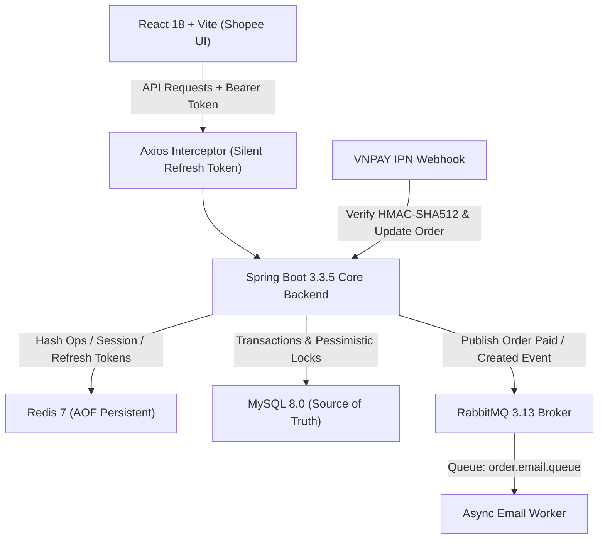
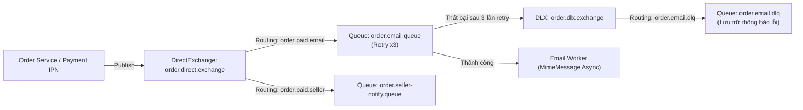
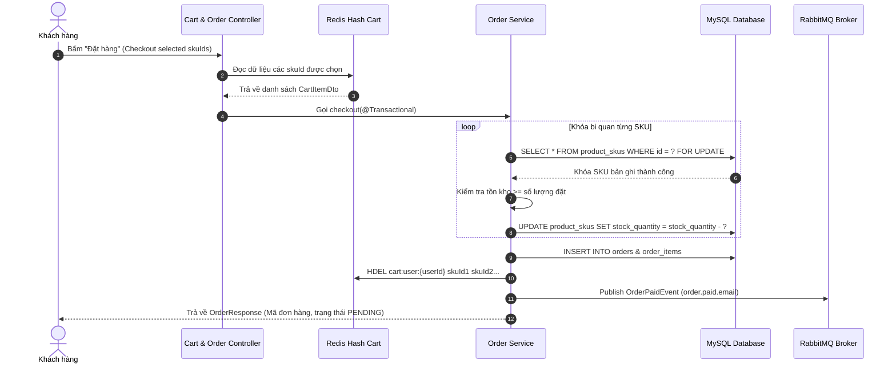

# TÀI LIỆU THIẾT KẾ KIẾN TRÚC HỆ THỐNG: PROJECT 2

Tài liệu mô tả chi tiết kiến trúc tổng thể, sơ đồ luồng dữ liệu, cấu trúc dữ liệu giỏ hàng trên Redis và cơ chế xử lý bất đồng bộ qua RabbitMQ.

---

## 1. SƠ ĐỒ KIẾN TRÚC MỞ RỘNG (SYSTEM ARCHITECTURE MATRIX)



---

## 2. ĐỘNG CƠ GIỎ HÀNG REDIS (REDIS CART ENGINE SPECIFICATION)

### 2.1. Cấu trúc Key và Field
- **Redis Key**: `cart:user:{userId}` (Kiểu dữ liệu: **HASH**)
- **Field (Subkey)**: `{skuId}` (Mã định danh biến thể sản phẩm)
- **TTL**: **30 ngày (2,592,000 giây)**, tự động gia hạn mỗi khi giỏ hàng được cập nhật.

### 2.2. Cấu trúc Payload Value (JSON String)
```json
{
  "skuId": 105,
  "productId": 42,
  "shopId": 3,
  "shopName": "Anker Official Store",
  "productTitle": "Củ sạc nhanh Anker 20W GaN",
  "skuVariant": "Màu Trắng, Chân tròn",
  "imageUrl": "https://res.cloudinary.com/.../anker-white.jpg",
  "price": 250000.00,
  "quantity": 2,
  "stockAvailable": 50,
  "updatedAt": 1773289200
}
```

### 2.3. Cấu trúc Trả về Client (Phân nhóm theo Shop chuẩn Shopee)
```json
{
  "code": 200,
  "message": "Lấy thông tin giỏ hàng thành công",
  "data": {
    "userId": 1,
    "shops": [
      {
        "shopId": 3,
        "shopName": "Anker Official Store",
        "items": [
          {
            "skuId": 105,
            "productId": 42,
            "shopId": 3,
            "shopName": "Anker Official Store",
            "productTitle": "Củ sạc nhanh Anker 20W GaN",
            "skuVariant": "Màu Trắng, Chân tròn",
            "imageUrl": "https://res.cloudinary.com/.../anker-white.jpg",
            "price": 250000.00,
            "quantity": 2,
            "stockAvailable": 50,
            "updatedAt": 1773289200
          }
        ],
        "shopTotal": 500000.00,
        "shopItemCount": 2
      }
    ],
    "totalItems": 1,
    "totalQuantity": 2,
    "totalAmount": 500000.00
  },
  "timestamp": "2026-09-10T15:00:00"
}
```

---

## 3. ĐỊNH TUYẾN RABBITMQ & DEAD LETTER QUEUE (DLQ)



---

## 4. LUỒNG CHECKOUT TỪ REDIS CART VÀO MYSQL (HYBRID TRANSACTION)


