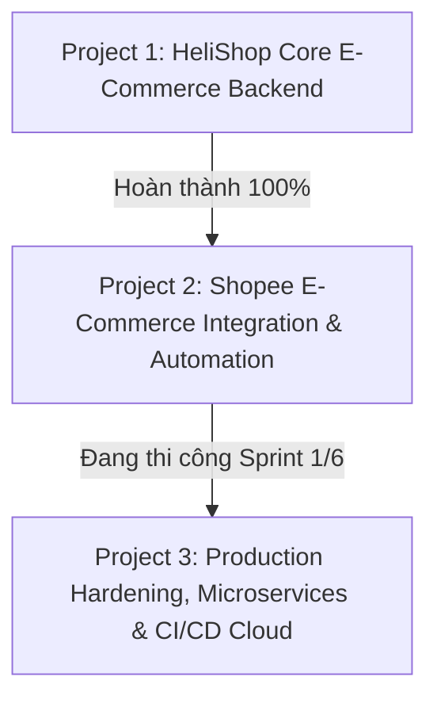

# LỘ TRÌNH DỰ ÁN TỔNG THỂ: HELISHOP E-COMMERCE

Tài liệu quản lý vòng đời phát triển, các giai đoạn (Phases), các dự án (Projects) và Sprint chi tiết từ khởi tạo đến bàn giao hoàn thiện.

---

## 🧭 TỔNG QUAN CÁC GIAI ĐOẠN (PROJECTS)

---

## 🌟 PROJECT 1: CORE E-COMMERCE BACKEND PLATFORM
- **Trạng thái**: ✅ **100% HOÀN THÀNH**
- **Commit Baseline**: `5d0ba9c`
- **Mục tiêu**: Xây dựng nền tảng backend Spring Boot 3.3.5 / Java 21, xác thực JWT, danh mục sản phẩm, khóa bi quan trừ kho và Redis Caching.

| Sprint | Nội dung thực hiện | Thời lượng | Trạng thái |
| :---: | :--- | :---: | :---: |
| **Sprint 1** | Thiết lập dự án, Docker (MySQL + Redis), BaseEntity, User, Shop | 3–4 ngày | ✅ Hoàn thành |
| **Sprint 2** | Spring Security 6, Stateless JWT, Refresh Token Redis, RBAC | 3–4 ngày | ✅ Hoàn thành |
| **Sprint 3** | Quản lý Hàng hóa & Danh mục đa cấp, Dynamic Filter JPA Spec, N+1 Query | 4–5 ngày | ✅ Hoàn thành |
| **Sprint 4** | Đặt hàng an toàn, Khóa bi quan (Pessimistic Lock), Chống âm kho | 3–4 ngày | ✅ Hoàn thành |
| **Sprint 5** | Tối ưu hiệu năng, Redis Distributed Cache, Cache-Aside Pattern | 3–4 ngày | ✅ Hoàn thành |
| **Sprint 6** | Dockerfile Multi-stage, Swagger OpenAPI 100%, Unit & Integration Test | 3–4 ngày | ✅ Hoàn thành |

---

## ⚡ PROJECT 2: SHOPEE E-COMMERCE INTEGRATION & AUTOMATION
- **Trạng thái**: 🚀 **ĐANG THI CÔNG (Sprint 1 Hoàn thành, Chuẩn bị Sprint 2)**
- **Kiến trúc trọng tâm**: Redis Cart Hash Map (TTL 30 ngày), RabbitMQ Message Broker với Dead Letter Queue (DLQ), VNPAY Webhook IPN, Async Email Worker, Media Cloudinary/S3, React 18 Shopee UI.

| Sprint | Nội dung thực hiện | Thời lượng | Trạng thái | Commit / Ghi chú |
| :---: | :--- | :---: | :---: | :--- |
| **Sprint 1** | **Hạ tầng RabbitMQ 3.13, Redis AOF Persistent, Redis Cart Engine Shopee** | 4–5 ngày | ✅ **Hoàn thành** | Commit `fe4d48c` (Đã push lên GitHub) |
| **Sprint 2** | **Cổng thanh toán VNPAY Sandbox, Ký số HMAC-SHA512 & Idempotent Webhook IPN** | 5 ngày | ✅ **Hoàn thành** | Commit `5b5bddb` (Đã push lên GitHub) |
| **Sprint 3** | **Async Email Worker, RabbitMQ Consumer, Retry x3 & Media Upload Cloudinary 1:1** | 4 ngày | ✅ **Hoàn thành** | Commit `4816bc8` (Đã push lên GitHub) |
| **Sprint 4** | **Frontend Core - React 18, Tailwind, Zustand & Axios failedQueue Silent Refresh** | 5 ngày | ✅ **Hoàn thành** | React 18, Vite, Shadcn UI, failedQueue Interceptor |
| **Sprint 5** | **Giao diện Toàn diện Chuẩn Shopee (Màu chủ đạo HeliShop Xanh Biển Ocean Blue)** | 5–6 ngày | ✅ **Hoàn thành** | Header Autocomplete, PDP 2 cấp SKU, Cart phân nhóm Shop, Sticky Checkout, VNPAY & 6 Tab Đơn hàng |
| **Sprint 6** | **Hủy đơn hàng, Hoàn trả kho nguyên tử & Dead Letter Alerting Engine** | 4 ngày | ⏳ *Kế tiếp* | Xử lý Dead Letter Messages & Alerting |

---

## 🎯 DEFINITION OF DONE (DOD) CHO TỪNG SPRINT
1. **Mã nguồn sạch**: Biên dịch thành công, không phát sinh cảnh báo quan trọng.
2. **Kiểm thử tự động**: 100% test case (Unit test & MockMvc Integration test) PASSED.
3. **Tài liệu hóa**: Cập nhật Swagger UI, các file Markdown trong `docs/`.
4. **Git Remote Push**: Toàn bộ mã nguồn phải được commit theo chuẩn Conventional Commits và **đẩy trực tiếp lên `origin/main`**.
